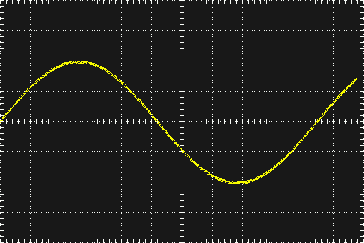

# Raspberry Pi Oscilloscope

This project aims at developing a bare metal digital oscilloscope software tool that the uses Raspberry Pi bare metal environment [circle-stdlib](https://github.com/smuehlst/circle-stdlib) which is based on [circle](https://github.com/rsta2/circle).

For measuring voltage signals I have used an ADC ([TLC2543](http://www.ti.com/product/TLC2543) from Texas Instruments).

The simulation for GUI is done using the pc simulator provided by LittlevGL community. The simulation codes are available [here](https://github.com/Ashreya12/DSO-GUI).

steps for setting up
Use the circle_stdlib_app.h file from this repo.
Key changes in header file:
- This header file initializes an mGui objecet of CLittlevGL type.
- Also SPI object is initialized 

### GUI development

The GUI is being developed using [LittlevGL](https://littlevgl.com) which is an open-source embedded GUI library.

The folder gui-testing contains code that is being used to test certain graphics components on raspberry pi.

As this is a repetitive process which involves frequent removal and installation of SD card, this code is modified to run on QEMU emulator. This can be found inside the folder qemu. Note that qemu currently has support for raspi2 and raspi3 (kindly check if qemu has added support for previous versions). So the test code that runs on qemu is configured to run on raspberry pi 3. The configuration for circle to make it work with qemu are :

AARCH	 ?= 64
RASPPI	 ?= 3
toolchain=aarch64-elf-

(you can have two builds for circle-stdlib, one for your actual implementation and one for testing using qemu)